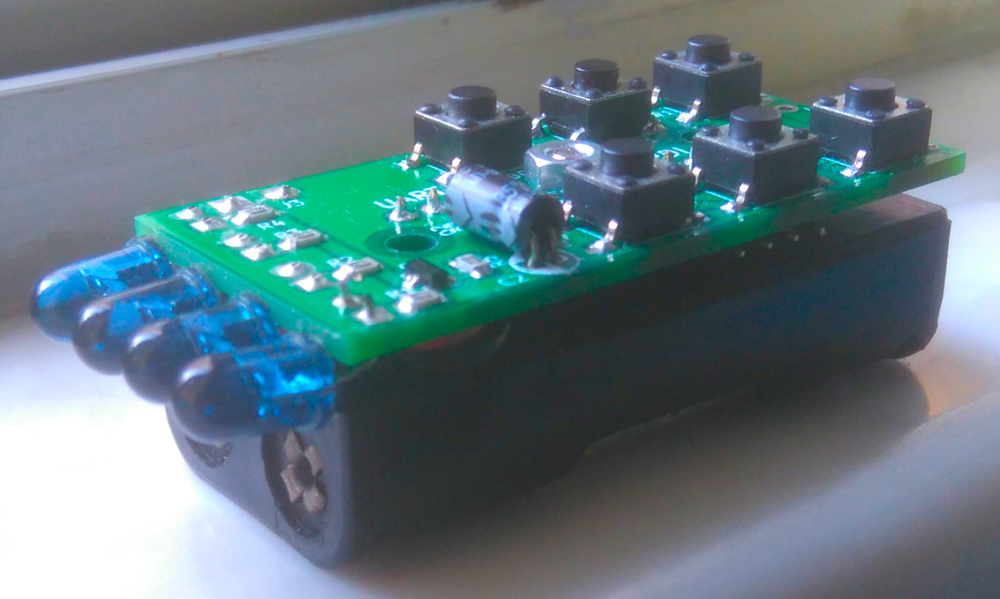
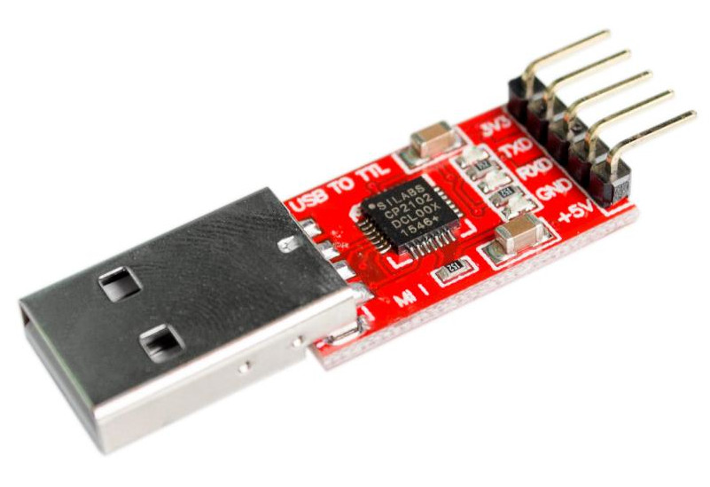

# tinyRemote
An infrared remote control with attiny414\
powered by 2 x AAA

## Keys
```
              ____
vol- (99)    |o  o| ch-  (77)
vol+ (32)    |o  o| ch+  (31)
shift(power) |o  o| input(mute)
             |____|
              UUUU

Hit SHIFT and indicator will turn on. Then hit a button while indicator is on.
It shall work for SHARP, LG and TOSHIBA.
It shall also work for SONY, PHILIPS and SAMSUNG. (but not yet verified)
```
## Connecting to PC

```
              ____
             |o  o| GND
      [UART] |o  o| 3V3
         GND |o  o| [UPDI]
         3V3 |____|
              UUUU
```
Connect tinyRemote to PC using a USB2TTL module via UPDI port or UART port. UPDI port is for programming attiny414. I am using [pyupdi](https://github.com/mraardvark/pyupdi).\
UART port is used for reading infrared code. There is an infrared transistor near the LED indicator. Point your remote controller CLOSE to it. To enter reading mode:
1. remove batteries
2. power up tinyRemote via UART port
3. IF SUCCESS, indicator will turn on. (It is a minor bug!)

Baud rate is 115200. PC will receive BINARIES from tinyRemote representing the durations of marks and spaces. ZERO means break. The timing unit is 4.8 us.\
b2str.cpp is to convert the binaries to readable text string. The output will be durations in us.\
Decoding is done by PC (decode.cpp)\
pronto.cpp converts pronto hex to durations stream that to be decoded by decode.cpp
